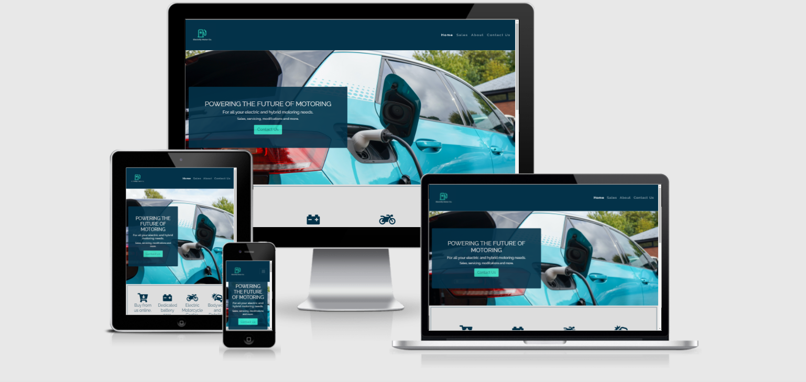

# Electrify Motor Co. 

[View the live site](https://cjglen.github.io/Electrify-Ms1/)

This site is built for an electric/hybrid vehicle specialist that is looking to expand its customer base, showcasing what they offer and how they are different. The site aims to be easy on the eye and simple to navigate, with the potential to be scaled up and new features added easily.

## Technologies Used

Languages:

* [HTML5](https://en.wikipedia.org/wiki/HTML5)
* [CSS3](https://en.wikipedia.org/wiki/CSS)

Libraries, Frameworks and Programs:

* [Bootstrap](https://getbootstrap.com/)

   * Bootstrap was used to assist with the styling and responsiveness of the site, creating a proffesional looking appearance.    
* [Font Awesome](https://fontawesome.com/)

  * Font Awesome was used for the clickable Social media icons in the footer and also the icons on the home page.

* [Google Fonts](https://fonts.google.com/)

  * Google fonts were used for the project, incorporating 'Raleway' and 'Montserrat'. These are linked into the head of index.html. 

* [Git Pod](https://www.gitpod.io/)

  * Gitpod was used to build the project and the terminal used to commit and push to Github.

* [Git Hub](https://github.com/)

  * Git Hub is used to store the projects code after being pushed from Git and also currently publishing it.

* [Chrome DevTools](https://developer.chrome.com/docs/devtools/)

  * Chrome Devtools has assisted with the build of the site, used to check positioning, responsiveness and implementing changes.

* [Balsamiq](https://balsamiq.com/)

  * Balsamiq was used to create the original Wireframes for the project at its inception.
    
            
        
        
        
    

