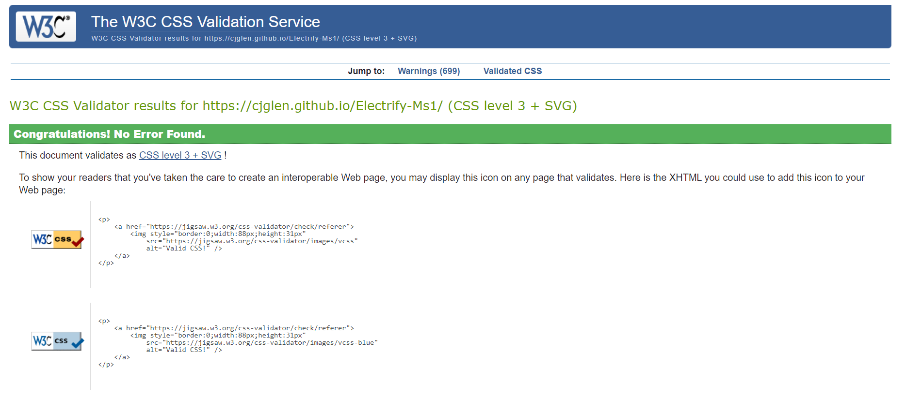

# Electrify Motor Co. 

[View the live site](https://cjglen.github.io/Electrify-Ms1/)

This site is built for an electric/hybrid vehicle specialist that is looking to expand its customer base, showcasing what they offer and how they are different. The site aims to be easy on the eye and simple to navigate, with the potential to be scaled up and new features added easily.

## User Experience (UX)

### Website Goals

The website has been designed with mobile first thinking. Making it easy to use on any device. 

The UX has been structured around as many calls to actions as possible, taking the user to the Contact Us page and therefore creating business opportunties. It has been designed in a way that is easy to scale up and add new features. For example, a dedicated sales page for a car dealership is essential and that would be added at a later date.

The goals at this stage are to increase brand awareness, increase sales and contact to the business and drive awareness of the social media channels.

### User Stories

* First Time Visitor Goals:
   1. As a first time user, I want to easily establish the purpose of the site and learn more about what the company does.
   2. As a first time user, I want to be able to navigate the website without much thought and find what I need easily.
   3. As a first time visitor, I want to be able to find links to their social media channels and view any supporting content they produce.

* Returning Visitor Goals:
   1. As a returning visitor, I wish to be able to pick up where I left off and find an easy way to contact the company directly.
   2. As a returning visitor, I want to find information about how they will benefit me if I choose to use their services.
   3. As a returning visitor, I want to be able to work on my tablet or mobile.

* Frequent Visitor Goals:
   1. As a frequent visitor, I want to be able to access the site on any device and use all the facilities available.
   2. As a frequent visitor, I want to see a detailed list of services and make purchases directly on the site.

## Design

### Colours

Colours used throughout the site are:

These colours are used in the logo and consistently throughout the site. I chose these colours as I feel the teal shade is on trend and goes with the modern feel and aims of the business. The blue complements the teal and gives the site a professional look.

### Fonts

Raleway is the main font throughout the site, with sans serif as the fallback option. The hex color #dddddd is used for most of the typography to complement the other colors throughout the site.

### Wireframes

 
  * [Desktop](assets/wireframes/desktop-home-ms1.png)
  * [Tablet](assets/wireframes/ipad-home-ms1.png)
  * [Mobile](assets/wireframes/iphone-home-ms1.png)

### Screenshots

  * Navbar 

  * Footer 

  * Top of Homepage 

  * Contact Form Page 

## Technologies Used

### Languages:

* [HTML5](https://en.wikipedia.org/wiki/HTML5)
* [CSS3](https://en.wikipedia.org/wiki/CSS)

### Libraries, Frameworks and Other tools:

* [Bootstrap](https://getbootstrap.com/)

   * Bootstrap was used to assist with the styling and responsiveness of the site, creating a professional looking appearance.    
* [Font Awesome](https://fontawesome.com/)

  * Font Awesome was used for the clickable social media icons in the footer and also the icons on the home page.

* [Google Fonts](https://fonts.google.com/)

  * Google fonts were used for the project, incorporating 'Raleway' and 'Montserrat'. These are linked into the head of index.html. 

* [Git Pod](https://www.gitpod.io/)

  * Gitpod was used to build the project and the terminal used to commit and push to GitHub.

* [Git Hub](https://github.com/)

  * GitHub is used to store the projects code after being pushed from Git and also currently publishing it.

* [Chrome DevTools](https://developer.chrome.com/docs/devtools/)

  * Chrome Devtools has assisted with the build of the site, used to check positioning, responsiveness and implementing changes.

* [Balsamiq](https://balsamiq.com/)

  * Balsamiq was used to create the original Wireframes for the project at its inception.

* [Unsplash](https://unsplash.com/)

  * All images on the site are used from Unsplash.

  ## Features

 * The Navigation bar is the same on every page, it is responsive and compacts into a burger icon on smaller devices. It houses the company logo and options to navigate through the site, with space to add more.

 * Footer, this again is consistent across the site, it is home to the clickable social icons which open on separate tabs. 

 * The homepage is home to a background image with Bootstrap Jumbotron, there is a call to action button included. Further down the page there are two other sections, one including Font Awesome icons to show the business services and the next section using Bootstrap cards with images.

 * The About Us page has more info about the business and includes more bootstrap cards and is inspired by an example on the [Bootstrap](https://getbootstrap.com/docs/5.0/examples/) site.

 * The Contact Us page is a full background image with a responsive contact us form built with Bootstrap and CSS. This is where most of the call to action buttons lead. The user must input their name, email and telephone number with a message included to submit succesfully.

 ## Potential Future Features

 1. A dedicated sales page, with cards featuring new and used cars/bikes for sale.
 2. Changes to the homepage, including changing the  jumbotron to moving images and links to featured products.
 3. Further use of the Company Logo throughout the site to promote the business and make it become more recognisable.
 4. Updates to the footer, with links to contact the company directly, with a chat board and a map link.
 5. Affiliate marketing links and more cta to generate business.

 ## Testing 

 Chrome DevTools was used throughout the project for testing and debugging styling and positional issues.

 ### HTML5

 I ran the completed sites code through [W3C Markup Validation Service](https://validator.w3.org/) with no errors or warnings to show.

 

 ### CSS3

 I also ran it through [W3C CSS Validation Service](https://jigsaw.w3.org/css-validator/) also with no errors or warnings.

 

 ### Device Testing

 The site has been tested on multiple devices, including a 24inch desktop, 13 inch laptop, Sony Xperia 5, Samsung a51 and Iphone 12 pro. 
 
 The only issue I have discovered is that on screens smaller than an Iphone 5, the jumbotron content pushes upwards, which I will try and fix in a later update.

 ### User testing

 The site can be a little slow on some devices to load the background image on the Contact Us page, this is something I am going to look at fixing asap. The cards at the bottom of the home screen are also occasionally slow to load.

 ## Deployment

 ### GitHub Pages

 This website has been deployed using GitHub pages, to do this...

 1. Log into your GitHub account and find the repository.
 2. Click on 'Settings' and scroll down to find the 'Pages' option.
 3. Click 'Source' and select 'None' and then 'Master branch'.
 4. Save it and refresh.
 5. Page is now deployed, it can be found under GitHub pages.

 To run it locally:

 1. Log in to GitHub and click on repository to download.
 2. Click on the 'Code' button. Download the ZIP file.
 3. Once you have downloaded the file, it can be extracted and used in your local enviroment.

 ## Credits

 ### Images

 All images used on the site are copyright-free from unsplash, the photo's are taken by:

 * [Charlotte Stowe](https://unsplash.com/photos/WkqHU1G2_sg)
 * [Andreas Dress](https://unsplash.com/photos/MBW3F1jEhh0)
 * [Harley-Davidson](https://unsplash.com/photos/9yx3FyexTOU)
 * [David Von Deiemar](https://unsplash.com/photos/dcAC2gblAVQ)
 * [Charlie van Rooy](https://unsplash.com/photos/iCPpeZnGrlM)
 * [Matt Seymour](https://unsplash.com/photos/3uu5_kn1k_Y)
 * [Tom Radetzki](https://unsplash.com/photos/czUK3rgnVio)
 

 ### Code

* [Bootstrap](https://getbootstrap.com/) Bootstrap was used throughout the site, most for layout and responsiveness.
* [W3Schools](https://www.w3schools.com/) W3 Schools was used as a learning resource throughout the project.
* [Code Institue](https://codeinstitute.net/) Code Institute LMS used for learning during the project as this is part of the course.
* [W3 Validator](https://validator.w3.org/) For checking HTML is valid with no errors.
* [W3C CSS Validator](https://jigsaw.w3.org/css-validator/) For CSS validation.

## Acknowledgements

* [Code Institue](https://codeinstitute.net/) The code institue for the LMS and tutor support, plus the Slack community for resources and guidance.
* [Harlow College](https://www.harlow-college.ac.uk/) Patrick Justus for holding a weekly info session.

 
    
            
        
        
        
    

